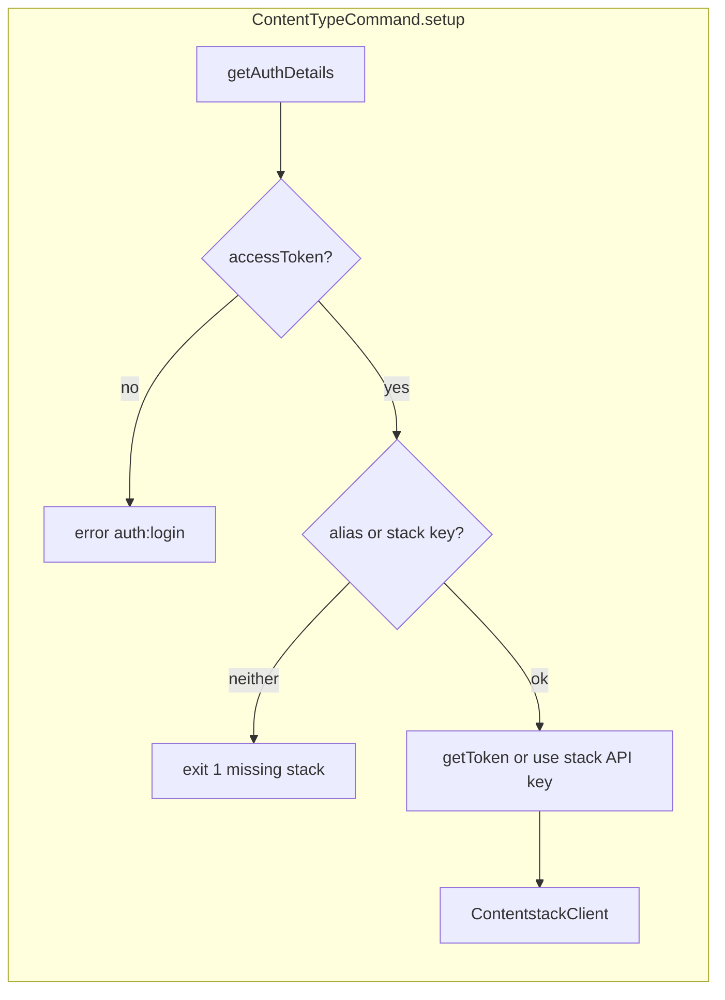

# Architecture

## Command → core modules

| Command file | Core / utilities | Notes |
|--------------|------------------|--------|
| `src/commands/content-type/audit.ts` | `core/content-type/audit.ts`, `utils` (`getStack`, `getUsers`, `getContentType`), `client.getContentTypeAuditLogs` | Audit + users for display |
| `src/commands/content-type/compare.ts` | `core/content-type/compare.ts`, `utils` | Same-stack two versions; optional `--left` / `--right` |
| `src/commands/content-type/compare-remote.ts` | `core/content-type/compare.ts` (same `buildOutput`), `utils` | Two stacks; `setup` uses origin stack key only |
| `src/commands/content-type/details.ts` | `core/content-type/details.ts`, `utils`, `client.getContentTypeReferences` | `--path` / `--no-path` |
| `src/commands/content-type/diagram.ts` | `core/content-type/diagram.ts`, `utils` (`getStack`, `getContentTypes`, `getGlobalFields`) | Writes file via Graphviz |
| `src/commands/content-type/list.ts` | `core/content-type/list.ts`, `utils` | `--order title|modified` |

Formatting helpers live under `src/core/content-type/formatting.ts` where imported by core modules.

## Auth flow (high level)

- **`compare-remote`**: `setup` is called with `{ alias: undefined, stack: flags["origin-stack"] }` so `apiKey` is the **origin** stack API key; remote stack is passed only in `getStack` / `getContentType` calls.

## CMA request shape (ContentstackClient)

- **Base URL**: `https://{cmaHost}/v3/` (`cmaHost` from command context).
- **Default axios headers**: `authorization: <token>` if token string includes `Bearer`, else `authtoken: <token>`.
- **Per-request**: `headers: { api_key: <stack API key> }` for stack-scoped routes.

| Method | HTTP | Path / params |
|--------|------|----------------|
| `getContentTypeAuditLogs` | GET | `/audit-logs` — `params.query.$and`: `module: content_type`, `metadata.uid` |
| `getContentTypeReferences` | GET | `/content_types/{uid}/references` — `include_global_fields: true` |

Errors: response `data.errors` → `ContentstackError`; optional suffix with stack API key when `data.errors.api_key` and context `api_key` are set.

## Compare output pipeline

`core/content-type/compare.ts` builds a unified diff from two JSON snapshots (`git-diff`), parses with **diff2html**, writes a **temporary HTML** file, opens it in the browser (`cli-ux` / `cli.open`). Not a terminal table.

## Diagram pipeline

`core/content-type/diagram.ts` builds a DOT graph, runs **node-graphviz** (`graphviz` binary must be available on the system for SVG rendering). Output path is sanitized where utilities apply.
