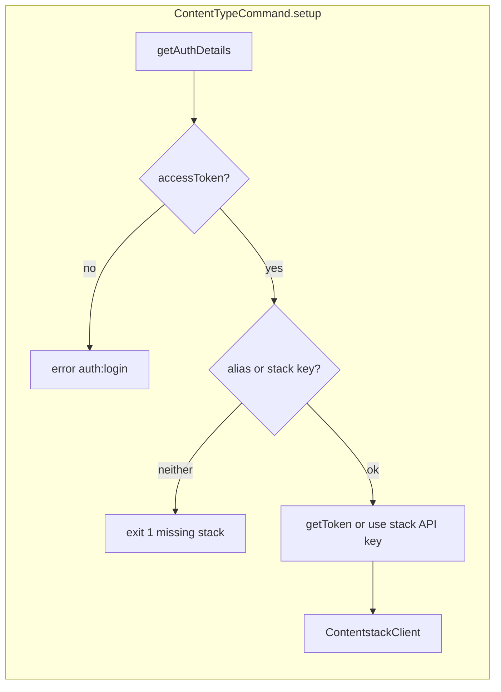

# Content Type CLI plugin – contentstack-cli-content-type

## When to use

- Editing commands under `src/commands/content-type/`, `ContentTypeCommand`, or `src/core/command.ts`.
- Changing CMA REST usage (`ContentstackClient`), Management SDK calls in `src/utils/index.ts`, or error handling in `src/core/contentstack/`.
- Working on compare/diagram HTML or Graphviz output, or regenerating CLI docs after command changes (see also [dev-workflow/SKILL.md](../dev-workflow/SKILL.md) for exact scripts).

## Instructions

### Repository role

npm package `contentstack-cli-content-type`: a **Contentstack CLI** (`csdx`) plugin that reads Content Type metadata from a stack—list, field details, audit log lines, version or cross-stack comparison, and stack content-model diagrams.

### Code layout

| Area | Path |
|------|------|
| Command classes (oclif) | `src/commands/content-type/*.ts` |
| Shared base | `src/core/command.ts` — `ContentTypeCommand` extends `@contentstack/cli-command` `Command` |
| Core output / logic | `src/core/content-type/*.ts` |
| HTTP client (axios CMA) | `src/core/contentstack/client.ts`, `src/core/contentstack/error.ts` |
| Stack / CT fetch helpers | `src/utils/index.ts` (uses Management SDK from `@contentstack/cli-utilities`) |
| Types | `src/types/index.ts` |
| Config (pagination limits) | `src/config/index.ts` |

Commands **parse flags**, call **`setup(flags)`**, build **`managementSDKClient`**, then call utils + core builders.

### Command → core modules

| Command file | Core / utilities | Notes |
|--------------|------------------|--------|
| `src/commands/content-type/audit.ts` | `core/content-type/audit.ts`, `utils` (`getStack`, `getUsers`, `getContentType`), `client.getContentTypeAuditLogs` | Audit + users for display |
| `src/commands/content-type/compare.ts` | `core/content-type/compare.ts`, `utils` | Same-stack two versions; optional `--left` / `--right` |
| `src/commands/content-type/compare-remote.ts` | `core/content-type/compare.ts` (same `buildOutput`), `utils` | Two stacks; `setup` uses origin stack key only |
| `src/commands/content-type/details.ts` | `core/content-type/details.ts`, `utils`, `client.getContentTypeReferences` | `--path` / `--no-path` |
| `src/commands/content-type/diagram.ts` | `core/content-type/diagram.ts`, `utils` (`getStack`, `getContentTypes`, `getGlobalFields`) | Writes file via Graphviz |
| `src/commands/content-type/list.ts` | `core/content-type/list.ts`, `utils` | `--order title|modified` |

Formatting helpers live under `src/core/content-type/formatting.ts` where imported by core modules.

### Auth flow (high level)

- **`compare-remote`**: `setup` is called with `{ alias: undefined, stack: flags["origin-stack"] }` so `apiKey` is the **origin** stack API key; remote stack is passed only in `getStack` / `getContentType` calls.

### Authentication and stack identity

1. `authenticationHandler.getAuthDetails()`; must have **access token** or command exits with `auth:login` message (`exit: 2`).
2. User must pass **either** a **management token alias** (`-a` / `--alias` or `--token-alias`) **or** **stack API key** (`-k` / `--stack-api-key`) or deprecated `--stack` (maps to stack key). If neither: error and `process.exit(1)` (message references “token alias or stack UID”).
3. Token alias: `getToken(alias)` → `apiKey` from token; warns if token type is not `management`.
4. `ContentTypeCommand` constructs **`ContentstackClient(this.cmaHost, authToken)`** for REST calls that use `api_key` in headers.

**Do not log** tokens, `authorization` / `authtoken` headers, or full CLI credentials.

### Two ways to call APIs

- **Axios `ContentstackClient`**: `GET https://{cmaHost}/v3/...` with default headers `authorization` (if Bearer) or `authtoken`, plus per-request `headers: { api_key }`. Used for audit logs and CT references. Errors → `ContentstackError` via `buildError`.
- **Management SDK** (`managementSDKClient({ host, 'X-CS-CLI': ... })`): stack fetch, content types, global fields, content type by version—see `src/utils/index.ts`.

**CMA request shape (`ContentstackClient`)**

- **Base URL**: `https://{cmaHost}/v3/` (`cmaHost` from command context).
- **Default axios headers**: `authorization: <token>` if token string includes `Bearer`, else `authtoken: <token>`.
- **Per-request**: `headers: { api_key: <stack API key> }` for stack-scoped routes.

| Method | HTTP | Path / params |
|--------|------|----------------|
| `getContentTypeAuditLogs` | GET | `/audit-logs` — `params.query.$and`: `module: content_type`, `metadata.uid` |
| `getContentTypeReferences` | GET | `/content_types/{uid}/references` — `include_global_fields: true` |

Errors: response `data.errors` → `ContentstackError`; optional suffix with stack API key when `data.errors.api_key` and context `api_key` are set.

### Compare and diagram pipelines

- **Compare**: `core/content-type/compare.ts` builds a unified diff from two JSON snapshots (`git-diff`), parses with **diff2html**, writes a **temporary HTML** file, opens it in the browser (`cli-ux` / `cli.open`). Not a terminal table.
- **Diagram**: `core/content-type/diagram.ts` builds a DOT graph, runs **node-graphviz** (`graphviz` binary must be available on the system for SVG rendering). Output path is sanitized where utilities apply.

### Commands (flags and behavior)

Primary sources: `README.md` and `src/commands/content-type/*.ts`.

#### `content-type:list`

- **Flags**: `--stack-api-key` (`-k`), `--stack` (deprecated → use stack key), `--token-alias` / `--alias` (`-a`), `--order` (`-o`) `title` \| `modified` (default `title`).
- **Files**: `src/commands/content-type/list.ts`, `src/core/content-type/list.ts`.
- **Behavior**: Lists Content Types for the stack; table output via core builder.

#### `content-type:details`

- **Flags**: stack identity flags as above; `--content-type` (`-c`) required; `--path` / `--no-path` (`-p`) — default shows path column; use `--no-path` on narrow terminals (README).
- **Files**: `src/commands/content-type/details.ts`, `src/core/content-type/details.ts`.
- **Behavior**: Fetches CT + **references** via `ContentstackClient.getContentTypeReferences`.

#### `content-type:audit`

- **Flags**: stack identity + `--content-type` (`-c`) required.
- **Files**: `src/commands/content-type/audit.ts`, `src/core/content-type/audit.ts`.
- **Behavior**: Audit logs via `getContentTypeAuditLogs`; README notes **audit log retention** (e.g. 90 days) per Contentstack docs.

#### `content-type:compare`

- **Flags**: stack identity + `--content-type` (`-c`); optional `--left` (`-l`) / `--right` (`-r`) **integers** (both required if either set). If omitted, command infers latest version vs previous from discovery fetch.
- **Files**: `src/commands/content-type/compare.ts`, `src/core/content-type/compare.ts`.
- **Behavior**: Side-by-side diff in **HTML** in a browser; not stdout-only. Warns if left === right.

#### `content-type:compare-remote`

- **Flags**: `--origin-stack` (`-o`) and `--remote-stack` (`-r`) **required** (stack API keys); `--content-type` (`-c`) required. No token-alias flow for two stacks—setup uses **origin** stack key for session.
- **Files**: `src/commands/content-type/compare-remote.ts`, same `core/content-type/compare.ts` as same-stack compare.
- **Behavior**: Same HTML diff pipeline; compares CT JSON from two stacks. Warns if origin === remote API key.

#### `content-type:diagram`

- **Flags**: stack identity; `--output` (`-o`) **required** (full path); `--direction` (`-d`) `portrait` \| `landscape` (required in schema, default portrait); `--type` (`-t`) `svg` \| `dot` (default svg).
- **Files**: `src/commands/content-type/diagram.ts`, `src/core/content-type/diagram.ts`.
- **Behavior**: Loads all content types + global fields; renders graph. **Graphviz** must be installed for typical SVG generation; DOT export available. README documents `-t dot` for raw DOT language.

### Editing checklist

| Change | Touch first |
|--------|-------------|
| New flag / description | Command file under `src/commands/content-type/`, then `oclif readme` |
| Output format / table | `src/core/content-type/*.ts`, `formatting.ts` |
| REST audit/references | `src/core/contentstack/client.ts`, `error.ts` |
| SDK pagination / fetch | `src/utils/index.ts`, `src/config/index.ts` |

### Build and CLI metadata

`package.json` scripts **`prepack`** and **`version`** drive `tsc`, `oclif manifest`, and `oclif readme`. After changing commands, flags, or descriptions, keep **README.md** and **oclif.manifest.json** in sync—see [dev-workflow/SKILL.md](../dev-workflow/SKILL.md) for commands and workflow.

### Short command names (csdx)

`package.json` → `csdxConfig.shortCommandName`:

| Command id | Short name |
|------------|------------|
| `content-type:audit` | CTAUDIT |
| `content-type:compare` | CTCMP |
| `content-type:compare-remote` | CTCMP-R |
| `content-type:details` | CTDET |
| `content-type:diagram` | CTDIAG |
| `content-type:list` | CTLS |

## References

- [dev-workflow/SKILL.md](../dev-workflow/SKILL.md) — TypeScript build, ESLint, oclif docs, `npm run prepack`.
- [testing/SKILL.md](../testing/SKILL.md) — Jest layout, mocks, coverage.
- [Content Management API](https://www.contentstack.com/docs/developers/apis/content-management-api/) (external).
